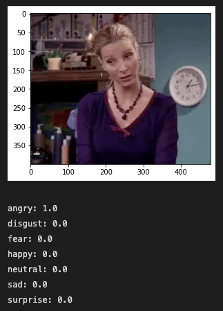
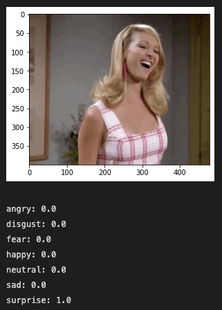

# Emotion Classification

- Used [transfer learning](https://towardsdatascience.com/transfer-learning-with-vgg16-and-keras-50ea161580b4) to build a convolutional neural network with [FER2013 dataset](https://www.kaggle.com/datasets/msambare/fer2013) that can classify emotion from different photos (Phoebe from F.R.I.E.N.D.S).

## Dataset  

### For Training (FER 2013)

Angry | Disgust | Fear
-- | -- | --
 |  | 

Happy | Neutral | Sad | Surprise
-- | -- | -- | --
 |  |  | 

### For Testing (Phoebe)

 |  | 
-- | -- | --

## Predictions

Angry | Surprise
---- | ----
 | 

## Get Started

- (Optional) Create a virtual environment and activate it.

```bash
virtualenv venv
source venv/bin/activate
```

### Installation

- Make sure you have all the packages installed from requirements.txt.

```bash
pip install -m requirements-dev.txt

pip install -m requirements.txt
```

- Use the Jupyter Notebook (`test.ipynb`) to build the model and test the model's accuracy.

### Train the Model

```bash
python3 model/train.py
```

### Fine-tune the Model

```bash
python3 model/fine_tune.py
```

### Test the Model

```bash
pytest -v --cov --cov-report term-missing
```